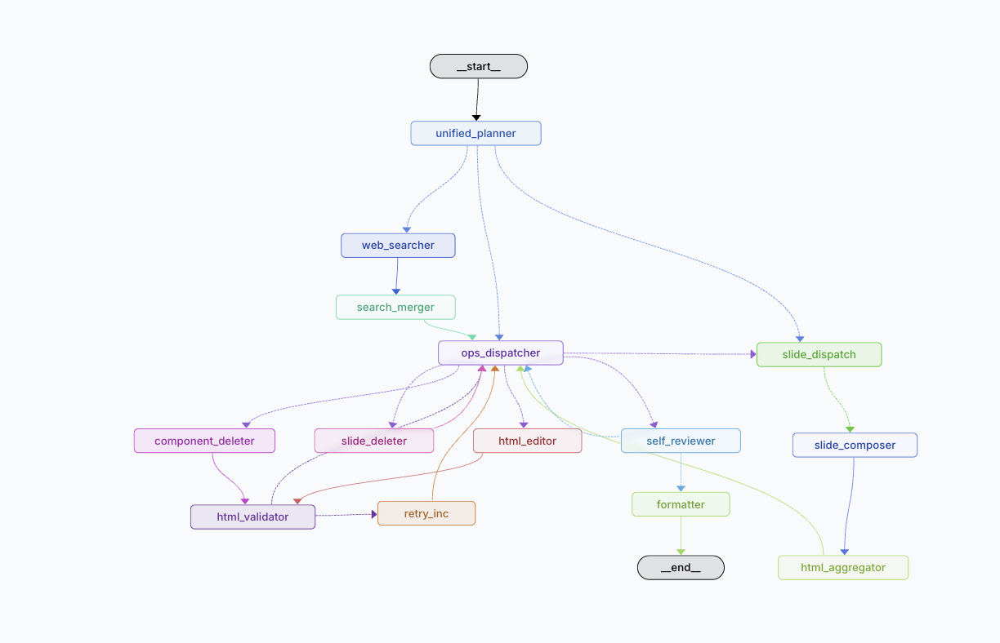

# Slidant

**[English](README.md)**

**여러 AI Agent가 협업해서 슬라이드를 만들어주는 도구**

Slidant는 AI Agent 여러 개가 역할을 나눠 HTML 슬라이드를 생성하고 편집하는 플랫폼입니다. 사용자가 자연어로 요청하면 Agent들이 슬라이드를 직접 만들어오고, 사용자는 각 Agent의 수정안을 컴포넌트 단위로 승인하거나 거절할 수 있습니다.

---

## 무엇이 다른가

기존 AI 슬라이드 도구들은 "생성"에 집중합니다. 한 번 만들어주고 끝. Slidant는 **지속적인 편집과 협업**을 중심으로 설계했습니다.

| | 기존 AI PPT 도구 | Slidant |
|--|--|--|
| 편집 방식 | 전체 재생성 | 컴포넌트 단위 수정 |
| AI 역할 | 단일 생성기 | 역할 분담 협업 Agent |
| 변경 추적 | 없음 | 버전 히스토리 + 롤백 |
| 충돌 처리 | 없음 | 충돌 시각화 + 수동 해결 |
| 표현력 | 템플릿 제한 | CSS 전체 (애니메이션, SVG 등) |

---

## 핵심 개념

### 슬라이드 = HTML

슬라이드는 HTML 문자열 하나로 저장됩니다. 브라우저가 그대로 렌더링하기 때문에 CSS로 할 수 있는 건 전부 됩니다 — 그라디언트, 애니메이션, SVG, 블러 효과 등.

```html
<div class="slide">
  <div data-component-id="bg" style="position:absolute;inset:0;background:#0A0F1E"></div>
  <div data-component-id="title" style="position:absolute;left:80px;top:170px;font-size:68px;color:#F9FAFB">
    제목
  </div>
</div>
```

모든 요소는 `data-component-id`를 가집니다. 이 ID가 승인 UI, 버전 diff, 충돌 감지의 기준점입니다.

### Agent 파이프라인



각 요청은 역할별 노드를 거쳐 처리됩니다:

- **unified_planner** — 의도 파악, 실행할 작업 결정
- **web_searcher / search_merger** — 필요 시 참고 자료 수집
- **ops_dispatcher** — 적절한 작업 노드로 라우팅
- **html_editor** — 기존 컴포넌트 편집
- **slide_composer / html_aggregator** — 신규 슬라이드 생성
- **component_deleter / slide_deleter** — 요소 삭제
- **self_reviewer / formatter** — 품질 검토 및 정리
- **html_validator / retry_inc** — HTML 유효성 검사, 실패 시 재시도

Agent는 슬라이드를 즉시 바꾸지 않습니다. 수정안(`AgentProposal`)을 제출하고, 사용자가 검토 후 원하는 컴포넌트만 골라서 반영할 수 있습니다.

### 역할 분담 Agent

기본 제공 Agent 3종:

| Agent | 담당 |
|-------|------|
| ContentAgent | 텍스트, 내용, 구조 |
| DesignAgent | 색상, 타이포그래피, 시각 스타일 |
| LayoutAgent | 위치, 간격, 구도 |

여러 Agent가 동시에 같은 슬라이드를 편집할 수 있습니다. 같은 컴포넌트를 건드리면 충돌이 감지되고, 사용자가 어떤 버전을 쓸지 직접 선택합니다.

### 버전 관리

모든 변경은 기록됩니다. 컴포넌트 단위 변경 이력을 볼 수 있고, 과거 스냅샷으로 롤백할 수 있습니다.

---

## 기술 스택

| 영역 | 기술 |
|------|------|
| 프론트엔드 | React + TypeScript + Vite |
| 슬라이드 렌더링 | `<iframe srcDoc>` |
| 백엔드 | FastAPI + Python 3.12 |
| Agent 오케스트레이션 | LangGraph |
| LLM | OpenRouter (기본) / Anthropic Claude |
| 데이터베이스 | PostgreSQL |
| 캐시 | Redis |
| 실시간 통신 | SSE (Server-Sent Events) |

---

## 시작하기

### 요구사항

- Docker & Docker Compose
- LLM API 키 (OpenRouter 또는 Anthropic)

### 실행

```bash
git clone https://github.com/bssm-oss/Slidant.git
cd slidant

cp .env.example .env
cp api/.env.example api/.env
# api/.env에 OPENROUTER_API_KEY 또는 ANTHROPIC_API_KEY 설정

docker compose up --build
```

- UI: `http://localhost`
- API: `http://localhost:8000`

### 로컬 개발

**백엔드**
```bash
cd api
python -m venv .venv && source .venv/bin/activate
pip install -r requirements.txt

docker compose up db redis -d  # 인프라만 실행
alembic upgrade head
uvicorn app.main:app --reload --port 8000
```

**프론트엔드**
```bash
cd ui
pnpm install
pnpm dev
```

---

## 보안

사용자가 직접 LLM API 키를 등록해서 사용합니다. 키는 AES-256(Fernet)으로 암호화해서 저장하고, 요청 처리 중에만 메모리에 plaintext가 존재합니다. 로그와 에러 응답에는 절대 기록되지 않습니다.

---

## 라이선스

MIT
