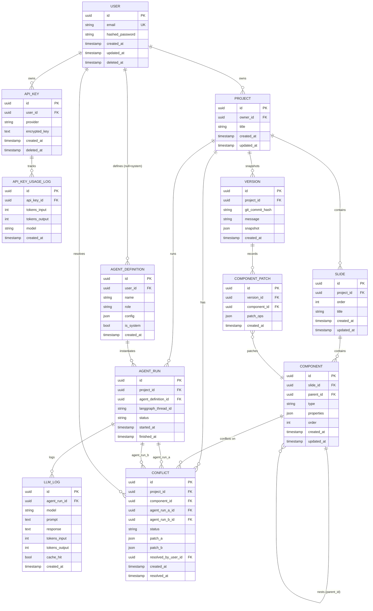

# Slidant BE — ERD

## 엔티티 요약

| 테이블 | 역할 |
|--------|------|
| `USER` | 계정 |
| `API_KEY` | 유저 LLM API key (암호화 저장) |
| `API_KEY_USAGE_LOG` | key 사용 내역 — 유저 조회용 |
| `PROJECT` | 슬라이드 묶음 단위 |
| `SLIDE` | 프로젝트 내 개별 슬라이드 |
| `COMPONENT` | 슬라이드 내 컴포넌트 트리 (`text`/`image`/`chart`/`layout`/`shape`) |
| `VERSION` | 프로젝트 전체 Git 스냅샷 |
| `COMPONENT_PATCH` | RFC 6902 JSON Patch — 컴포넌트 단위 diff 기록 |
| `AGENT_DEFINITION` | 시스템 기본 Agent + 유저 정의 커스텀 Agent |
| `AGENT_RUN` | LangGraph thread 실행 이력 |
| `LLM_LOG` | 프롬프트/응답 로그 (캐시 히트 여부 포함) |
| `CONFLICT` | Agent 간 동일 컴포넌트 충돌 — 병합 전까지 pending |

## 버전 관리 이중 구조

- **`VERSION` + `COMPONENT_PATCH`**: 컴포넌트 단위 정밀 추적 (RFC 6902 JSON Patch)
- **`VERSION.git_commit_hash`**: 프로젝트 전체 상태 Git 스냅샷 → 롤백 단위

## 보안 메모

- `API_KEY.encrypted_key`: Fernet(AES-256) 암호화값만 저장, plaintext 절대 기록 안 함
- `LLM_LOG`: sanitization 미들웨어로 key plaintext 필터링 후 저장
- `API_KEY.deleted_at` set → 계정 삭제 시 key 즉시 파기 처리
